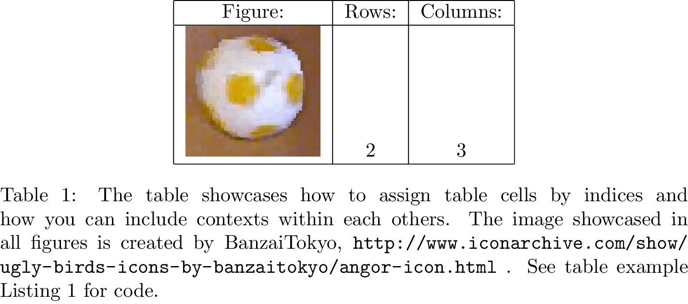

<h1 align="center">pylama: Make typesetting great again</h1>
<h3 align="center">Nils Bore</h3>

Pylama can be best described as a wrapper around the <code>LaTeX</code> typesetting system. It attempts to provide a cleaner syntax for your standard document while still allowing you to add latex inline when needed. The pylama language is built on top of the Python interpreter and, as opposed to <code>LaTeX</code>, the language is inspired by Python’s indentation based grouping of code and text. To execute code within your pylama document, you start the line with a <code>&gt;</code>, similar to command prompts like bash. Use one or multiple lines depending on the complexity of the task, all python code and libraries can be imported and used.

To start out your document, you typically type something like

. With this done, you can start building your document. Variables in the document are stored in a global context, so if you want to provide the environment with the basics and start out your document, you can type:

You declare subsections with respect to the parent section, avoiding having to type “sub” too many times and helping you keep track of the hierarchy.

Too get more familiar with the language, let’s look at how we can use pylama for maths.

Equations, like

can be declared with the following syntax:

Note the <code>equation1</code> assignment preceding the equation declaration. This gives us a handle that we can use to reference the equation later in the document using the syntax <code>&gt;ref(equation1)</code> with the result: 1. This has the great advantage that we can actually check if the variable is present in the current context and throw and error if that is not the case. In latex this would quietly fail with a question mark in the final document.

The other important thing to note is that there is an indent before the actual equation text. This declares that the text is a child of the <code>equation()</code> declaration. The equation environment takes care of processing the formula into text that can be inserted into the final <code>LaTeX</code> document. The indentation based syntax is a cornerstone of the pylama language and allows these so called contexts to be nested arbitrarily deep. The next section delves deeper into contexts.

Item lists are a good example for illustrating nested text blocks. At the top level sits an <code>&gt;itemize()</code> or <code>&gt;enumerate()</code> declaration. In the indented level, as children of the <code>&gt;itemize()</code>, sit several <code>&gt;item()</code> which in turn have their own children, typically text, that declare the content of the respective items. A complete list can be declared as

which results in the following list:

Note that the children block themselves can contain one or multiple text or code blocks and that they can be layered in several steps. This is illustrated in the next section, where we mix text and figures inside a table environment.

Usually, variables in pylama are declared in a global scope. For example, if you declare a variable <code>&gt;a=3</code> anywhere in your document, even inside a block, it will be accessible anywhere after that declaration. This allows you to reference a nested block even when you are on a higher level in the block hierarchy, as we will see in the subfigure example. However, there is one exception to this in the form of local variables. Local variables are declared by providing keyword arguments to the block functions. In the example below, <code>rows, cols</code> and <code>caption</code> are local variables and can only be referenced within the child block. Notice how we can use them in the table definition to display the size of the table.

The result can be viewed in Table 1. Note that indexing the blocks like this might be a slightly clumsy way of defining the contents of your table. Instead, we might use python lists to define the table below. Looping through and setting the blocks appropriately allows us to express this more compactly.

The resulting table is shown in Table 2.

Figures are defined in a way to let the most common types be very easy to define. Simply adding an image with a caption and a reference variable is as easy as:

All common code blocks that can be referenced return a reference variable, in this case <code>f1</code>. This can be easily referenced through <code>&gt;ref(f1)</code>, resulting in: 1. If you wish, you can also reference using a string, but in that case you need to provide the <code>label</code> argument.

A common case in scientific writing is also the use of tables containing figures, often with captions for each individual figure. This is enabled with the <code>figuretable()</code> function block, which works in a way very similar to ordinary tables, with the difference that all cells should contain only <code>subfigure()</code> function blocks. This is showcased in the example below:

Note the <code>sf1</code> assignment. This can be reference outside the figure table with the result: None.

Pylama is designed to make the common things easy while making the hard things possible. In that spirit, e.g. captions of figures and tables are provided as strings to the block function of the figure or table. However, sometimes you would like the captions themselves to be defined using the pylama functions and blocks. This is where the <code>lazy()</code> block function comes in. It enables you to define a block like:

This block will not get added in the text in that place of its declaration. Instead it will get added when you call <code>lazy_1.add()</code>. However, you could instead call <code>ss = lazy_1.string()</code>, resulting in a string <code>ss</code> with the block evaluated as text, which you can then provide as the caption argument to a figure, table, or other block function. Several of the more complex captions in the examples of this document were generated in this way.

Inside each block you have access to a variety of introspection details. Below are some examples of what you can access for example inside an equation block.

The <code>Context</code> class is the main interface for all of pylama. Through it, you can access details of the environment like in the example above, but it is also the mechanism through which the document is constructed. Importantly, no block gets added to the final document unless its parent block explicitly adds it. The <code>Context.context</code> object has a method, <code>Context.context.add()</code> which adds all of its child blocks into the document, which can then in turn add their children if they wish to. We will make our own version of the equation block function above to demonstrate this. Since all of our code should compile down to <code>LaTex</code>, we can simply write:

Now this can be put in a python file and exported as any other library into any pylama document. The function simply puts the proper declarations around the equation block and then adds the child blocks through the <code>Context.context.add()</code> function.

Splitting your text up between different <code>.pymd</code> or <code>.tex</code> files is generally considered good practice. A <code>.pymd</code> file can be included via the <code>input()</code> function while <code>.tex</code> files are imported via the <code>latexinput()</code> function. <code>.pymd</code> files get expanded within the larger environment, giving it access to declared variables there in order for it to e.g. reference figures or other sections. So, for example, if you have a file <code>test/input.pymd</code> you can import it with:

If the contents of the file are

this will result in the following line:

The following code cites a reference and adds a bibliography file to the document:

This results in the reference  and a bibliography at the end of the document.

